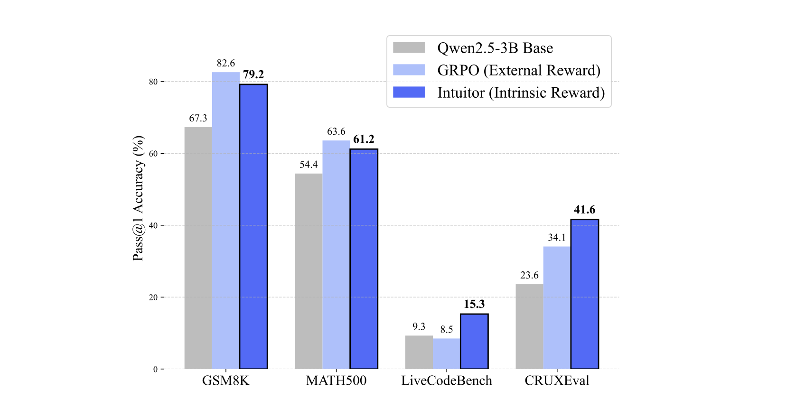

# Intuitor: Learning to Reason without External Rewards

[Paper](https://arxiv.org/abs/2505.19590)


**Update [2025-06-02]**: We have released four model checkpoints trained on the MATH dataset for one epoch. You're welcome to try out the models and evaluate their performance!

---

## 🔍 Released Models (MATH, 1 Epoch)

| Model Name | Size | Method | Hugging Face Link |
|------------|------|--------|--------------------|
| `sunblaze-ucb/Qwen2.5-1.5B-GRPO-MATH-1EPOCH` | 1.5B | GRPO | [View Model](https://huggingface.co/sunblaze-ucb/Qwen2.5-1.5B-GRPO-MATH-1EPOCH) |
| `sunblaze-ucb/Qwen2.5-3B-GRPO-MATH-1EPOCH` | 3B   | GRPO | [View Model](https://huggingface.co/sunblaze-ucb/Qwen2.5-3B-GRPO-MATH-1EPOCH) |
| `sunblaze-ucb/Qwen2.5-1.5B-Intuitor-MATH-1EPOCH` | 1.5B | Intuitor | [View Model](https://huggingface.co/sunblaze-ucb/Qwen2.5-1.5B-Intuitor-MATH-1EPOCH) |
| `sunblaze-ucb/Qwen2.5-3B-Intuitor-MATH-1EPOCH` | 3B   | Intuitor | [View Model](https://huggingface.co/sunblaze-ucb/Qwen2.5-3B-Intuitor-MATH-1EPOCH) |

---


Intuitor ships in two self-contained variants: open-r1-intuitor and verl-intuitor. Each variant is a complete implementation of the Intuitor algorithm, allowing you to choose the one that best fits your needs. The results presented in our paper were obtained using the open-r1 variant.

Both variant folders retain their original **Apache-2.0** `LICENSE` (and any accompanying `NOTICE`) files, as required by their respective upstream projects.

See the respective folder for more details:
- [open-r1-intuitor](./open-r1-intuitor/README.md)
- [verl-intuitor](./verl-intuitor/README.md)



## Getting started
---

Firstly, cd into the desired variant folder and set up the enviornment as specified in the `README.md` file of that variant. Then follow the instructions below to run the example training script.

### open-r1-intuitor

Modify the WANDB_KEY in the `run_intuitor.sh` script to your own WANDB key, then run the following command:

```bash
bash run_intuitor.sh
```

To facilitate future research, we have enabled combining self-certainty with other reward signals. If reward weights are not set to 0, self-certainty and other rewards will first be normalized separately, then added together.

### verl-intuitor

First, download the MATH dataset and prepare it using the following Python script:

```bash
python examples/data_preprocess/math_dataset.py
```

Then, run the following command to start the training:

```bash
bash math_intuitor.sh
```

(Modify the WANDB_KEY in the `math_intuitor.sh` script to your own WANDB key.)

---


## References

This project builds upon the following open-source repositories:

open-r1

* *Repository:* [open-r1](https://github.com/huggingface/open-r1) *License:* [Apache License 2.0](https://github.com/huggingface/open-r1/blob/main/LICENSE)
* *Description:* A community re-implementation of DeepSeek-R1 that provides transparent GRPO training.

verl

* *Repository:* [verl](https://github.com/volcengine/verl) *License:* [Apache License 2.0](https://github.com/volcengine/verl/blob/main/LICENSE)
* *Description:* A high-throughput RL training library featuring hybrid-controller data-flow, FSDP, and vLLM back-ends for large-scale LLM reinforcement learning.

---
## 📄 Citation

If you use Intuitor in your research, please cite our paper:
```bibtex
@article{zhao2025learning,
  title={Learning to Reason without External Rewards},
  author={Zhao, Xuandong and Kang, Zhewei and Feng, Aosong and Levine, Sergey and Song, Dawn},
  journal={arXiv preprint arXiv:2505.19590},
  year={2025}
}
```

